# BomberMan - Complete Class Diagram

This comprehensive class diagram shows all classes in the BomberMan project organized by package.

```mermaid
classDiagram
    %% ===== MAIN APPLICATION =====
    class BomberQuest {
        -GameManager gameManager
        +main(args: String[]) void
        +start() void
    }

    %% ===== CORE PACKAGE =====
    class GameManager {
        -instance: GameManager
        -currentState: GameState
        -previousState: GameState
        -transitionManager: TransitionManager
        -player: Player
        -walls: List~GameObject~
        -enemies: List~GameObject~
        -bombs: List~GameObject~
        -explosions: List~GameObject~
        -difficulty: Difficulty
        -gameStartTime: long
        -lastGameTime: long
        +getInstance() GameManager
        +init() void
        +resetGame() void
        +setState(state: GameState) void
        +setState(state: GameState, transition: TransitionType) void
        +setStateImmediate(state: GameState) void
        +update() void
        +render(g2d: Graphics2D) void
        +handleInput(keyCode: int) void
        +handleKeyReleased(keyCode: int) void
        +isValidMove(x: int, y: int, w: int, h: int, walls: List) boolean
        +calculateScore() int
        +setDifficulty(difficulty: Difficulty) void
        +getDifficulty() Difficulty
        +getPlayer() Player
        +getWalls() List~GameObject~
        +getEnemies() List~GameObject~
        +getBombs() List~GameObject~
        +getExplosions() List~GameObject~
    }

    class TransitionManager {
        -instance: TransitionManager
        -transitioning: boolean
        -type: TransitionType
        -transitionFrame: int
        -transitionDuration: int
        -toState: GameState
        -midTransition: boolean
        +getInstance() TransitionManager
        +startTransition(from: GameState, to: GameState, type: TransitionType) void
        +update(gm: GameManager) void
        +render(g2d: Graphics2D, gm: GameManager, w: int, h: int) void
        +isTransitioning() boolean
        -renderFade(g2d: Graphics2D, w: int, h: int, progress: float) void
        -renderSlideLeft(g2d: Graphics2D, w: int, h: int, progress: float) void
        -renderSlideRight(g2d: Graphics2D, w: int, h: int, progress: float) void
        -renderZoomOut(g2d: Graphics2D, w: int, h: int, progress: float) void
        -renderDissolve(g2d: Graphics2D, w: int, h: int, progress: float) void
    }

    class TransitionType {
        <<enumeration>>
        FADE
        SLIDE_LEFT
        SLIDE_RIGHT
        ZOOM_OUT
        DISSOLVE
    }

    class EntityFactory {
        +createWall(x: int, y: int, hard: boolean) GameObject
        +createEnemy(x: int, y: int) Enemy
        +createBomb(x: int, y: int, radius: int) Bomb
    }

    %% ===== STATES PACKAGE =====
    class GameState {
        <<interface>>
        +update() void
        +render(g: Graphics2D) void
        +enter() void
        +exit() void
        +handleInput(keyCode: int) void
        +handleKeyReleased(keyCode: int) void
    }

    class MainMenuState {
        -selectedOption: int
        +update() void
        +render(g: Graphics2D) void
        +enter() void
        +exit() void
        +handleInput(keyCode: int) void
    }

    class DifficultySelectionState {
        -selectedDifficulty: int
        +update() void
        +render(g: Graphics2D) void
        +enter() void
        +exit() void
        +handleInput(keyCode: int) void
    }

    class PlayingState {
        -paused: boolean
        -explosionPool: ObjectPool~Explosion~
        +update() void
        +render(g: Graphics2D) void
        +enter() void
        +exit() void
        +handleInput(keyCode: int) void
        -handlePlayerMovement(keyCode: int) void
        -handleBombPlacement() void
        -updateBombs() void
        -updateEnemies() void
        -checkCollisions() void
    }

    class GameOverState {
        +update() void
        +render(g: Graphics2D) void
        +enter() void
        +exit() void
        +handleInput(keyCode: int) void
    }

    class VictoryState {
        -playerName: String
        -time: int
        +update() void
        +render(g: Graphics2D) void
        +enter() void
        +exit() void
        +handleInput(keyCode: int) void
    }

    class LeaderboardState {
        +update() void
        +render(g: Graphics2D) void
        +enter() void
        +exit() void
        +handleInput(keyCode: int) void
    }

    class SettingsState {
        -selectedOption: int
        +update() void
        +render(g: Graphics2D) void
        +enter() void
        +exit() void
        +handleInput(keyCode: int) void
    }

    %% ===== ENTITIES PACKAGE =====
    class GameObject {
        <<abstract>>
        #x: int
        #y: int
        #color: Color
        #active: boolean
        +GameObject(x: int, y: int)
        +render(g: Graphics2D, tileSize: int) void
        +update() void
        +getX() int
        +getY() int
        +isActive() boolean
        +setActive(active: boolean) void
    }

    class Player {
        -hp: int
        -maxHp: int
        -invincibleTimer: int
        -activePowerUps: List~PowerUp~
        -speedBoost: double
        -maxBombs: int
        -bombRadius: int
        +Player(x: int, y: int)
        +update() void
        +render(g: Graphics2D, tileSize: int) void
        +damage() boolean
        +reset() void
        +addPowerUp(powerUp: PowerUp) void
        +getHp() int
        +setPosition(x: int, y: int) void
        +setSpeedBoost(multiplier: double) void
        +getSpeedBoost() double
        +addMaxBombs(amount: int) void
        +getMaxBombs() int
        +addBombRadius(amount: int) void
        +getBombRadius() int
        +getActivePowerUps() List~PowerUp~
    }

    class Enemy {
        -moveTimer: int
        -moveInterval: int
        -currentPath: List~int[]~
        -pathRecalculateTimer: int
        +Enemy(x: int, y: int)
        +tryMove(walls: List, enemies: List, bombs: List, player: Player, gridW: int, gridH: int) void
        +render(g: Graphics2D, tileSize: int) void
        -calculatePathToPlayer(walls: List, enemies: List, bombs: List, player: Player, gridW: int, gridH: int) void
        -tryGreedyMove(walls: List, enemies: List, bombs: List, player: Player, gridW: int, gridH: int) void
        -updateMoveInterval() void
        -isValidMove(tx: int, ty: int, walls: List, enemies: List, bombs: List, w: int, h: int) boolean
    }

    class Bomb {
        -timer: int
        -radius: int
        +Bomb(x: int, y: int, radius: int)
        +update() void
        +render(g: Graphics2D, tileSize: int) void
        +getRadius() int
    }

    class Explosion {
        -timer: int
        +Explosion(x: int, y: int)
        +update() void
        +render(g: Graphics2D, tileSize: int) void
    }

    class Wall {
        -destructible: boolean
        +Wall(x: int, y: int, destructible: boolean)
        +isDestructible() boolean
        +render(g: Graphics2D, tileSize: int) void
    }

    %% ===== POWERUPS PACKAGE =====
    class PowerUp {
        <<abstract>>
        #name: String
        #duration: int
        #active: boolean
        +PowerUp(name: String, duration: int)
        +apply(player: Player) void
        +remove(player: Player) void
        +update(player: Player) void
        +getName() String
        +isActive() boolean
        +getRemainingDuration() int
    }

    class SpeedBoost {
        -SPEED_MULTIPLIER: double
        -SPEED_BOOST_DURATION: int
        +SpeedBoost()
        +apply(player: Player) void
        +remove(player: Player) void
    }

    class BombCapacityBoost {
        -ADDITIONAL_BOMBS: int
        -CAPACITY_BOOST_DURATION: int
        +BombCapacityBoost()
        +apply(player: Player) void
        +remove(player: Player) void
    }

    class ExplosionRangeBoost {
        -ADDITIONAL_RANGE: int
        -RANGE_BOOST_DURATION: int
        +ExplosionRangeBoost()
        +apply(player: Player) void
        +remove(player: Player) void
    }

    %% ===== MANAGERS PACKAGE =====
    class SoundManager {
        -instance: SoundManager
        -sounds: Map~String, Clip~
        -currentMusic: Clip
        -musicVolumeScale: int
        -sfxVolumeScale: int
        -musicMuted: boolean
        -sfxMuted: boolean
        +getInstance() SoundManager
        +setMusicVolume(scale: int) void
        +getMusicVolume() int
        +setSFXVolume(scale: int) void
        +getSFXVolume() int
        +setMusicMuted(muted: boolean) void
        +isMusicMuted() boolean
        +setSFXMuted(muted: boolean) void
        +isSFXMuted() boolean
        +loadSound(name: String, path: String) void
        +playMusic(name: String) void
        +stopMusic() void
        +pauseMusic() void
        +resumeMusic() void
        +playSFX(name: String) void
        +initSounds() void
    }

    class LeaderboardManager {
        -instance: LeaderboardManager
        -scores: Map~String, Integer~
        +getInstance() LeaderboardManager
        +addScore(name: String, time: int) void
        +getTopScores() List~Entry~
        +isNameTaken(name: String) boolean
        -loadScores() void
        -saveScores() void
    }

    class SettingsManager {
        -instance: SettingsManager
        -resolution: Resolution
        -fullscreen: boolean
        -retroEffects: boolean
        -showFPS: boolean
        +getInstance() SettingsManager
        +getResolution() Resolution
        +setResolution(resolution: Resolution) void
        +isFullscreen() boolean
        +setFullscreen(fullscreen: boolean) void
        +isRetroEffects() boolean
        +setRetroEffects(retroEffects: boolean) void
        +isShowFPS() boolean
        +setShowFPS(showFPS: boolean) void
    }

    class Difficulty {
        <<enumeration>>
        EASY
        MEDIUM
        HARD
    }

    class Resolution {
        <<enumeration>>
        RES_640x480
        RES_800x600
        RES_1024x576
        RES_1024x768
        RES_1152x648
        RES_1280x720
        RES_1280x800
        RES_1366x768
        RES_1440x900
        RES_1600x900
        RES_1680x1050
        RES_1920x1080
        RES_2560x1440
        RES_3840x2160
        -width: int
        -height: int
        +getWidth() int
        +getHeight() int
    }

    %% ===== EVENTS PACKAGE =====
    class GameEvent {
        <<abstract>>
        -timestamp: long
        -priority: int
        +GameEvent()
        +GameEvent(priority: int)
        +getTimestamp() long
        +getPriority() int
        +compareTo(other: GameEvent) int
        +handle() void
    }

    class EventListener~T~ {
        <<interface>>
        +onEvent(event: T) void
    }

    class EventSystem~T~ {
        -listeners: Map~Class, List~
        -eventQueue: PriorityQueue~T~
        +EventSystem()
        +subscribe(eventType: Class, listener: EventListener) void
        +publish(event: T) void
        +queue(event: T) void
        +processQueue() void
        +getQueuedEventCount() int
        +unsubscribeAll(eventType: Class) void
        +clear() void
    }

    %% ===== UTILS PACKAGE =====
    class ObjectPool~T~ {
        -pool: Queue~T~
        -factory: Supplier~T~
        -maxSize: int
        -objectCount: int
        +ObjectPool(factory: Supplier, maxSize: int)
        +acquire() T
        +release(object: T) void
        +clear() void
        +getAvailableCount() int
        +getTotalObjectCount() int
    }

    class Grid~T~ {
        -data: T[][]
        -width: int
        -height: int
        +Grid(width: int, height: int)
        +get(x: int, y: int) T
        +set(x: int, y: int, value: T) void
        +isValid(x: int, y: int) boolean
        +getWidth() int
        +getHeight() int
        +stream() Stream~T~
        +forEach(consumer: BiConsumer) void
        +clear() void
        -validateCoordinates(x: int, y: int) void
    }

    class Pathfinding {
        +findPath(startX: int, startY: int, goalX: int, goalY: int, gridW: int, gridH: int, isWalkable: WalkableChecker) List~int[]~
        -heuristic(x1: int, y1: int, x2: int, y2: int) int
        -reconstructPath(goal: Node) List~int[]~
    }

    class PathfindingNode {
        -x: int
        -y: int
        -gCost: int
        -hCost: int
        -parent: Node
        +fCost() int
        +compareTo(other: Node) int
    }

    class WalkableChecker {
        <<interface>>
        +isWalkable(x: int, y: int) boolean
    }

    %% ===== EXCEPTIONS =====
    class GameInitializationException {
        +GameInitializationException(message: String)
    }

    %% ===== RELATIONSHIPS =====
    
    %% Main Application
    BomberQuest --> GameManager : uses
    
    %% Core
    GameManager --> GameState : manages
    GameManager --> TransitionManager : uses
    GameManager --> Player : manages
    GameManager --> GameObject : manages
    GameManager --> SoundManager : uses
    GameManager --> SettingsManager : uses
    GameManager --|> "Singleton" GameManager
    
    TransitionManager --> GameState : transitions
    TransitionManager --> TransitionType : uses
    TransitionManager --|> "Singleton" TransitionManager
    
    EntityFactory ..> GameObject : creates
    EntityFactory ..> Enemy : creates
    EntityFactory ..> Bomb : creates
    EntityFactory ..> Wall : creates
    
    %% States
    GameState <|.. MainMenuState : implements
    GameState <|.. DifficultySelectionState : implements
    GameState <|.. PlayingState : implements
    GameState <|.. GameOverState : implements
    GameState <|.. VictoryState : implements
    GameState <|.. LeaderboardState : implements
    GameState <|.. SettingsState : implements
    
    PlayingState --> ObjectPool : uses
    PlayingState --> Player : manages
    PlayingState --> Enemy : manages
    PlayingState --> Bomb : manages
    PlayingState --> Explosion : manages
    
    %% Entities
    GameObject <|-- Player : extends
    GameObject <|-- Enemy : extends
    GameObject <|-- Bomb : extends
    GameObject <|-- Explosion : extends
    GameObject <|-- Wall : extends
    
    Player --> PowerUp : has
    Enemy --> Pathfinding : uses
    
    %% PowerUps
    PowerUp <|-- SpeedBoost : extends
    PowerUp <|-- BombCapacityBoost : extends
    PowerUp <|-- ExplosionRangeBoost : extends
    
    PowerUp --> Player : decorates
    
    %% Managers
    SoundManager --|> "Singleton" SoundManager
    LeaderboardManager --|> "Singleton" LeaderboardManager
    SettingsManager --|> "Singleton" SettingsManager
    
    SettingsManager --> Resolution : uses
    SettingsManager --> Difficulty : uses
    GameManager --> Difficulty : uses
    
    %% Events
    EventSystem --> GameEvent : manages
    EventSystem --> EventListener : notifies
    EventListener --> GameEvent : receives
    
    %% Utils
    Pathfinding --> PathfindingNode : uses
    Pathfinding --> WalkableChecker : uses
    
    %% Exceptions
    GameInitializationException --|> Exception : extends

    %% Design Patterns Notes
    note for GameManager "Singleton Pattern"
    note for SoundManager "Singleton Pattern"
    note for LeaderboardManager "Singleton Pattern"
    note for SettingsManager "Singleton Pattern"
    note for TransitionManager "Singleton Pattern"
    note for PowerUp "Decorator Pattern"
    note for EntityFactory "Factory Pattern"
    note for EventSystem "Observer Pattern"
    note for ObjectPool "Object Pool Pattern"
    note for GameState "State Pattern"
```

## Design Patterns Used

### 1. **Singleton Pattern**
- `GameManager`
- `SoundManager`
- `LeaderboardManager`
- `SettingsManager`
- `TransitionManager`

### 2. **State Pattern**
- `GameState` interface with implementations:
  - `MainMenuState`
  - `PlayingState`
  - `GameOverState`
  - `VictoryState`
  - `SettingsState`
  - `LeaderboardState`
  - `DifficultySelectionState`

### 3. **Decorator Pattern**
- `PowerUp` abstract class decorating `Player`
  - `SpeedBoost`
  - `BombCapacityBoost`
  - `ExplosionRangeBoost`

### 4. **Factory Pattern**
- `EntityFactory` for creating game entities

### 5. **Observer Pattern**
- `EventSystem` with `EventListener` and `GameEvent`

### 6. **Object Pool Pattern**
- `ObjectPool<T>` for efficient object reuse

### 7. **Generic Programming**
- `ObjectPool<T>`
- `Grid<T>`
- `EventSystem<T>`
- `EventListener<T>`

## Package Structure

- **com.bomberman** - Main application entry point
- **com.bomberman.core** - Core game management classes
- **com.bomberman.states** - Game state implementations
- **com.bomberman.entities** - Game objects and characters
- **com.bomberman.powerups** - Power-up system
- **com.bomberman.managers** - Singleton managers
- **com.bomberman.events** - Event system
- **com.bomberman.utils** - Utility classes
- **com.bomberman.exceptions** - Custom exceptions
