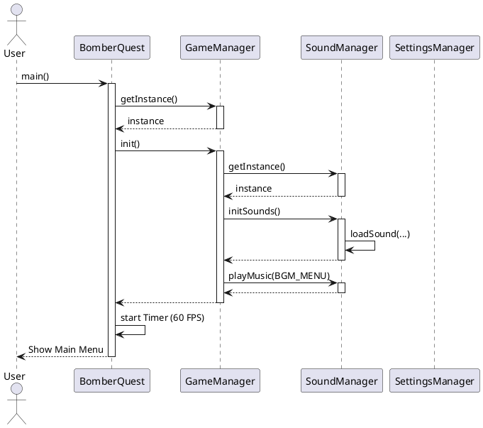
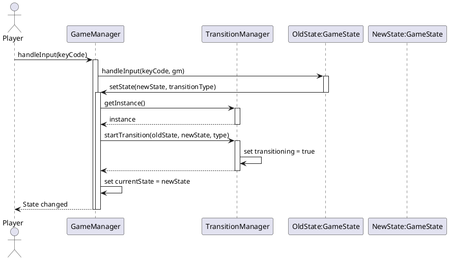
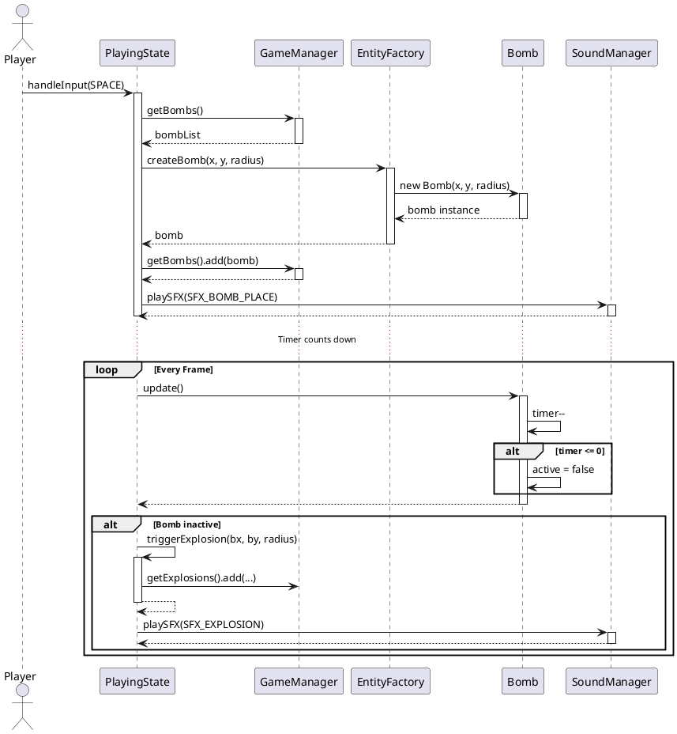
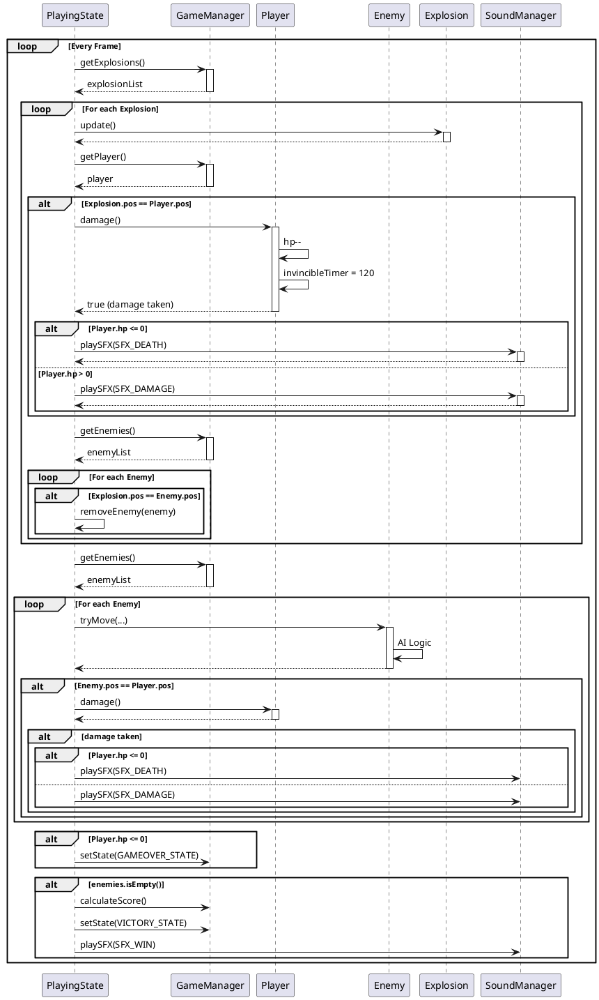
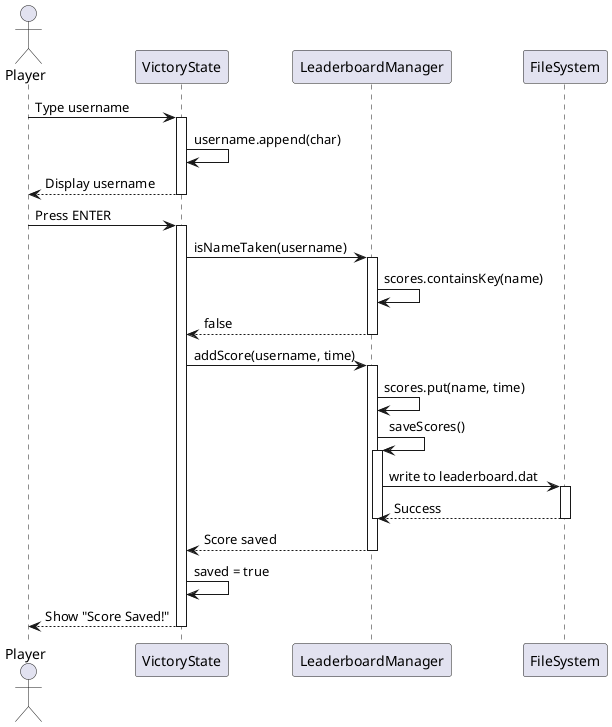

# BomberQuest - Design Documentation

## Table of Contents
1. [Architecture Overview](#architecture-overview)
2. [Design Patterns](#design-patterns)
3. [Class Diagram](#class-diagram)
4. [Package Structure](#package-structure)
5. [Relationships & Dependencies](#relationships--dependencies)
6. [Sequence Diagrams](#sequence-diagrams)

---

## Architecture Overview

BomberQuest menggunakan arsitektur berbasis **State Pattern** dan **MVC (Model-View-Controller)** yang dimodifikasi untuk game development.

### Architectural Layers:

```
┌─────────────────────────────────────────────────┐
│           Presentation Layer                     │
│  (BomberQuest.java - Swing UI & Rendering)      │
└─────────────────────────────────────────────────┘
                    ↓
┌─────────────────────────────────────────────────┐
│           Game Logic Layer                       │
│  - GameManager (Core Controller)                │
│  - GameState (State Pattern)                    │
│  - TransitionManager (Visual Effects)           │
└─────────────────────────────────────────────────┘
                    ↓
┌─────────────────────────────────────────────────┐
│           Entity Layer                           │
│  - GameObject (Abstract Base)                   │
│  - Player, Enemy, Bomb, Explosion, Wall         │
└─────────────────────────────────────────────────┘
                    ↓
┌─────────────────────────────────────────────────┐
│           Manager Layer                          │
│  - SoundManager (Audio)                         │
│  - SettingsManager (Configuration)              │
│  - LeaderboardManager (Persistence)             │
└─────────────────────────────────────────────────┘
```

---

## Design Patterns

### 1. **Singleton Pattern**

**Used in:**
- `GameManager`
- `SoundManager`
- `SettingsManager`
- `LeaderboardManager`
- `TransitionManager`

**Purpose:** Memastikan hanya ada satu instance dari manager classes untuk mengelola state global game.

**Implementation:**
```java
public class GameManager {
    private static GameManager instance;
    
    private GameManager() {}
    
    public static synchronized GameManager getInstance() {
        if (instance == null) {
            instance = new GameManager();
        }
        return instance;
    }
}
```

---

### 2. **State Pattern**

**Used in:** Game State Management

**Purpose:** Mengelola berbagai state game (Menu, Playing, GameOver, dll) dengan clean separation of concerns.

**Components:**
- **Context:** `GameManager`
- **State Interface:** `GameState`
- **Concrete States:**
  - `MainMenuState`
  - `DifficultySelectionState`
  - `PlayingState`
  - `PauseState` (embedded in PlayingState)
  - `GameOverState`
  - `VictoryState`
  - `SettingsState`
  - `LeaderboardState`

**State Diagram:**
```
          ┌──────────────┐
          │ MainMenuState│◄───────────┐
          └──────┬───────┘            │
                 │                    │
                 ↓                    │
    ┌────────────────────────┐       │
    │DifficultySelectionState│       │
    └────────────┬───────────┘       │
                 │                    │
                 ↓                    │
         ┌──────────────┐            │
         │ PlayingState │            │
         └──┬───────┬───┘            │
            │       │                │
            ↓       ↓                │
    ┌────────┐ ┌────────┐           │
    │GameOver│ │Victory │           │
    └────┬───┘ └───┬────┘           │
         │         │                │
         └─────────┴────────────────┘
              
         ┌────────────┐
         │SettingsState│◄──────────┐
         └────────────┘            │
                                   │
         ┌───────────────┐         │
         │LeaderboardState├─────────┘
         └───────────────┘
```

---

### 3. **Factory Pattern**

**Used in:** `EntityFactory`

**Purpose:** Centralisasi pembuatan game entities dengan logic yang konsisten.

**Implementation:**
```java
public class EntityFactory {
    public static GameObject createWall(int x, int y, boolean hard);
    public static Enemy createEnemy(int x, int y);
    public static Bomb createBomb(int x, int y, int radius);
}
```

---

### 4. **Observer Pattern (Simplified)**

**Used in:** Settings Change Notification

**Purpose:** Notify UI untuk update ketika settings berubah.

**Implementation:**
```java
public interface SettingsApplyListener {
    void onSettingsApplied();
}

// GameManager implements observer
gameManager.setSettingsListener(() -> checkSettingsChange());
```

---

### 5. **Template Method Pattern**

**Used in:** `GameObject` abstract class

**Purpose:** Mendefinisikan skeleton untuk game entities dengan abstract methods yang di-override.

**Implementation:**
```java
public abstract class GameObject {
    public abstract void render(Graphics2D g, int tileSize);
    public void update() {} // Default implementation
}
```

---

### 6. **Strategy Pattern (Implicit)**

**Used in:** AI Movement in `Enemy`

**Purpose:** Different movement strategies based on difficulty.

---

## Class Diagram

### Complete UML Class Diagram

```plantuml
@startuml BomberQuest_Complete_Class_Diagram

' Styling
skinparam classAttributeIconSize 0
skinparam class {
    BackgroundColor<<Main>> LightBlue
    BackgroundColor<<Core>> LightGreen
    BackgroundColor<<Entity>> LightYellow
    BackgroundColor<<State>> LightPink
    BackgroundColor<<Manager>> LightCyan
    BackgroundColor<<Exception>> LightCoral
    BorderColor Black
    ArrowColor Black
}

' Main Entry Point
class BomberQuest <<Main>> {
    - timer: Timer
    - gameManager: GameManager
    - {static} frame: JFrame
    - wasFullscreen: boolean
    - lastFpsTime: long
    - frameCount: int
    - currentFps: int
    
    + BomberQuest()
    + paintComponent(Graphics): void
    + actionPerformed(ActionEvent): void
    - updatePreferredSize(): void
    - checkSettingsChange(): void
    - toggleFullscreen(boolean): void
    + {static} main(String[]): void
}

' Core Package
package "com.bomberman.core" <<Core>> {
    
    class GameManager {
        - {static} instance: GameManager
        + {static} TILE_SIZE: int = 48
        + {static} GRID_W: int = 25
        + {static} GRID_H: int = 15
        + {static} BOMB_RADIUS: int = 3
        + {static} MAX_BOMBS: int = 3
        
        - walls: List<GameObject>
        - enemies: List<GameObject>
        - bombs: List<GameObject>
        - explosions: List<GameObject>
        - player: Player
        - currentState: GameState
        - gameStartTime: long
        - lastGameTime: int
        - currentDifficulty: Difficulty
        - settingsListener: SettingsApplyListener
        
        + PLAYING_STATE: GameState
        + GAMEOVER_STATE: GameState
        + VICTORY_STATE: GameState
        + MAIN_MENU_STATE: GameState
        + LEADERBOARD_STATE: GameState
        + SETTINGS_STATE: GameState
        + DIFFICULTY_SELECTION_STATE: GameState
        
        - GameManager()
        + {static} getInstance(): GameManager
        + init(): void
        + resetGame(): void
        + update(): void
        + render(Graphics2D): void
        + handleInput(int): void
        + handleKeyReleased(int): void
        + setState(GameState): void
        + setState(GameState, TransitionType): void
        + setStateImmediate(GameState): void
        + setDifficulty(Difficulty): void
        + getDifficulty(): Difficulty
        + calculateScore(): void
        + {static} isValidMove(...): boolean
        + notifySettingsApplied(): void
        + getPlayer(): Player
        + getWalls(): List<GameObject>
        + getEnemies(): List<GameObject>
        + getBombs(): List<GameObject>
        + getExplosions(): List<GameObject>
        + getGameStartTime(): long
        + getLastGameTime(): int
    }
    
    interface SettingsApplyListener {
        + onSettingsApplied(): void
    }
    
    class EntityFactory {
        + {static} createWall(int, int, boolean): GameObject
        + {static} createEnemy(int, int): Enemy
        + {static} createBomb(int, int, int): Bomb
    }
    
    class TransitionManager {
        - {static} instance: TransitionManager
        - transitioning: boolean
        - type: TransitionType
        - transitionFrame: int
        - transitionDuration: int
        - fromState: GameState
        - toState: GameState
        - midTransition: boolean
        
        - TransitionManager()
        + {static} getInstance(): TransitionManager
        + startTransition(GameState, GameState, TransitionType): void
        + update(GameManager): void
        + render(Graphics2D, GameManager, int, int): void
        - renderFade(Graphics2D, int, int, float): void
        - renderSlideLeft(Graphics2D, int, int, float): void
        - renderSlideRight(Graphics2D, int, int, float): void
        - renderZoomOut(Graphics2D, int, int, float): void
        - renderDissolve(Graphics2D, int, int, float): void
        + isTransitioning(): boolean
    }
    
    enum TransitionType {
        FADE
        SLIDE_LEFT
        SLIDE_RIGHT
        ZOOM_OUT
        DISSOLVE
    }
}

' Entity Package
package "com.bomberman.entities" <<Entity>> {
    
    abstract class GameObject {
        # x: int
        # y: int
        # color: Color
        # active: boolean
        
        + GameObject(int, int)
        + {abstract} render(Graphics2D, int): void
        + update(): void
        + getX(): int
        + getY(): int
        + isActive(): boolean
        + setActive(boolean): void
    }
    
    class Player {
        - hp: int
        - maxHp: int
        - invincibleTimer: int
        - INVINCIBLE_TIME: int = 120
        
        + Player(int, int)
        + update(): void
        + render(Graphics2D, int): void
        + damage(): boolean
        + getHp(): int
        + reset(): void
        + setPosition(int, int): void
    }
    
    class Enemy {
        - moveTimer: int
        - moveInterval: int
        
        + Enemy(int, int)
        + tryMove(List, List, List, Player, int, int): void
        + render(Graphics2D, int): void
        - getMoveInterval(): int
        - isValidMove(...): boolean
    }
    
    class Bomb {
        - timer: int = 120
        - radius: int
        
        + Bomb(int, int, int)
        + update(): void
        + render(Graphics2D, int): void
        + getRadius(): int
    }
    
    class Explosion {
        - timer: int = 15
        
        + Explosion(int, int)
        + update(): void
        + render(Graphics2D, int): void
    }
    
    class Wall {
        - destructible: boolean
        
        + Wall(int, int, boolean)
        + isDestructible(): boolean
        + render(Graphics2D, int): void
    }
}

' State Package
package "com.bomberman.states" <<State>> {
    
    interface GameState {
        + update(GameManager): void
        + render(Graphics2D, GameManager): void
        + handleInput(int, GameManager): void
        + handleKeyReleased(int, GameManager): void
    }
    
    class MainMenuState {
        - selection: int
        - options: String[]
        - showExitConfirmation: boolean
        
        + update(GameManager): void
        + render(Graphics2D, GameManager): void
        + handleInput(int, GameManager): void
    }
    
    class DifficultySelectionState {
        - selection: int = 1
        - options: String[]
        - descriptions: String[]
        - previewWalls: List<GameObject>
        - previewEnemies: List<GameObject>
        - previewPlayer: Player
        - lastSelection: int
        
        + update(GameManager): void
        + render(Graphics2D, GameManager): void
        + handleInput(int, GameManager): void
        - updatePreview(int): void
        - drawPreview(Graphics2D, int, int, int): void
    }
    
    class PlayingState {
        - pressedKeys: Set<Integer>
        - moveDelay: int
        - MOVE_DELAY_MAX: int = 8
        - paused: boolean
        - pauseSelection: int
        - pauseOptions: String[]
        
        + update(GameManager): void
        + render(Graphics2D, GameManager): void
        + handleInput(int, GameManager): void
        + handleKeyReleased(int, GameManager): void
        - handleMovement(GameManager): void
        - triggerExplosion(GameManager, int, int, int): void
        - renderHUD(Graphics2D, GameManager): void
        - renderPauseMenu(Graphics2D, GameManager): void
    }
    
    class GameOverState {
        + update(GameManager): void
        + render(Graphics2D, GameManager): void
        + handleInput(int, GameManager): void
    }
    
    class VictoryState {
        - username: StringBuilder
        - saved: boolean
        - errorMessage: String
        
        + update(GameManager): void
        + render(Graphics2D, GameManager): void
        + handleInput(int, GameManager): void
        + reset(): void
    }
    
    class SettingsState {
        - selection: int
        - options: String[]
        - pendingResolution: Resolution
        - pendingFullscreen: boolean
        - pendingRetroEffects: boolean
        - pendingShowFPS: boolean
        - initialized: boolean
        
        - init(): void
        + update(GameManager): void
        + render(Graphics2D, GameManager): void
        + handleInput(int, GameManager): void
        - drawCheckbox(Graphics2D, int, int, boolean): void
        - applySettings(GameManager): void
    }
    
    class LeaderboardState {
        - leaderboardManager: LeaderboardManager
        
        + LeaderboardState()
        + update(GameManager): void
        + render(Graphics2D, GameManager): void
        + handleInput(int, GameManager): void
    }
}

' Manager Package
package "com.bomberman.managers" <<Manager>> {
    
    class SoundManager {
        - {static} instance: SoundManager
        - sounds: Map<String, Clip>
        - currentMusic: Clip
        - musicVolume: float = -10.0f
        - sfxVolume: float = -5.0f
        
        + {static} BGM_MENU: String
        + {static} BGM_GAME: String
        + {static} SFX_BOMB_PLACE: String
        + {static} SFX_EXPLOSION: String
        + {static} SFX_POWERUP: String
        + {static} SFX_DEATH: String
        + {static} SFX_DAMAGE: String
        + {static} SFX_WIN: String
        + {static} SFX_SELECT: String
        
        - SoundManager()
        + {static} getInstance(): SoundManager
        + loadSound(String, String): void
        + playMusic(String): void
        + stopMusic(): void
        + playSFX(String): void
        - setVolume(Clip, float): void
        + initSounds(): void
    }
    
    class SettingsManager {
        - {static} instance: SettingsManager
        - resolution: Resolution
        - fullscreen: boolean
        - retroEffects: boolean
        - showFPS: boolean
        
        - SettingsManager()
        + {static} getInstance(): SettingsManager
        + getResolution(): Resolution
        + setResolution(Resolution): void
        + isFullscreen(): boolean
        + setFullscreen(boolean): void
        + isRetroEffects(): boolean
        + setRetroEffects(boolean): void
        + isShowFPS(): boolean
        + setShowFPS(boolean): void
    }
    
    enum Resolution {
        RES_800x600(800, 600)
        RES_1280x720(1280, 720)
        RES_1920x1080(1920, 1080)
        
        - width: int
        - height: int
        
        Resolution(int, int)
        + getWidth(): int
        + getHeight(): int
        + toString(): String
    }
    
    enum Difficulty {
        EASY
        MEDIUM
        HARD
    }
    
    class LeaderboardManager {
        - {static} FILE_NAME: String = "leaderboard.dat"
        - scores: Map<String, Integer>
        - {static} instance: LeaderboardManager
        
        - LeaderboardManager()
        + {static} getInstance(): LeaderboardManager
        - loadScores(): void
        + addScore(String, int): void
        - saveScores(): void
        + getTopScores(): List<Entry>
        + isNameTaken(String): boolean
    }
}

' Exception Package
package "com.bomberman.exceptions" <<Exception>> {
    class GameInitializationException {
        + GameInitializationException(String)
    }
}

' Relationships

' Main relationships
BomberQuest --> GameManager : uses
BomberQuest ..> SettingsManager : queries

' GameManager relationships
GameManager --> GameState : manages
GameManager --> Player : has
GameManager --> "0..*" GameObject : manages
GameManager --> SettingsApplyListener : implements
GameManager ..> EntityFactory : uses
GameManager ..> TransitionManager : uses
GameManager ..> SoundManager : uses
GameManager ..> SettingsManager : uses
GameManager ..> LeaderboardManager : uses
GameManager ..> GameInitializationException : throws

' State relationships
GameState <|.. MainMenuState : implements
GameState <|.. DifficultySelectionState : implements
GameState <|.. PlayingState : implements
GameState <|.. GameOverState : implements
GameState <|.. VictoryState : implements
GameState <|.. SettingsState : implements
GameState <|.. LeaderboardState : implements

' State uses managers
PlayingState ..> SoundManager : uses
PlayingState ..> EntityFactory : uses
MainMenuState ..> SoundManager : uses
DifficultySelectionState ..> EntityFactory : uses
DifficultySelectionState ..> SettingsManager : uses
VictoryState ..> LeaderboardManager : uses
SettingsState ..> SettingsManager : uses
LeaderboardState --> LeaderboardManager : has

' Entity relationships
GameObject <|-- Player : extends
GameObject <|-- Enemy : extends
GameObject <|-- Bomb : extends
GameObject <|-- Explosion : extends
GameObject <|-- Wall : extends

' EntityFactory creates entities
EntityFactory ..> GameObject : creates
EntityFactory ..> Wall : creates
EntityFactory ..> Enemy : creates
EntityFactory ..> Bomb : creates

' Enemy uses Player for AI
Enemy ..> Player : tracks
Enemy ..> GameManager : uses

' TransitionManager relationships
TransitionManager --> TransitionType : uses
TransitionManager ..> GameState : transitions
TransitionManager ..> GameManager : updates

' SettingsManager relationships
SettingsManager +-- Resolution : contains
SettingsManager +-- Difficulty : contains

' Exception hierarchy
Exception <|-- GameInitializationException : extends

@enduml
```



---

## Package Structure

```
com.bomberman/
│
├── BomberQuest.java                    # Main entry point & UI
│
├── core/                               # Core game logic
│   ├── GameManager.java                # Central game controller (Singleton)
│   ├── EntityFactory.java              # Factory for creating entities
│   └── TransitionManager.java          # Visual transition effects (Singleton)
│
├── entities/                           # Game objects
│   ├── GameObject.java                 # Abstract base class
│   ├── Player.java                     # Player entity
│   ├── Enemy.java                      # Enemy entity with AI
│   ├── Bomb.java                       # Bomb entity
│   ├── Explosion.java                  # Explosion entity
│   └── Wall.java                       # Wall entity
│
├── states/                             # Game states (State Pattern)
│   ├── GameState.java                  # State interface
│   ├── MainMenuState.java              # Main menu
│   ├── DifficultySelectionState.java   # Difficulty selection
│   ├── PlayingState.java               # Active gameplay
│   ├── GameOverState.java              # Game over screen
│   ├── VictoryState.java               # Victory screen with input
│   ├── SettingsState.java              # Settings configuration
│   └── LeaderboardState.java           # Leaderboard display
│
├── managers/                           # Singleton managers
│   ├── SoundManager.java               # Audio management
│   ├── SettingsManager.java            # Game settings
│   └── LeaderboardManager.java         # Score persistence
│
└── exceptions/                         # Custom exceptions
    └── GameInitializationException.java # Init error handling
```

---

## Relationships & Dependencies

### Dependency Graph

```
BomberQuest (Main)
    ↓
GameManager (Core Controller)
    ↓
    ├──→ GameState Interface
    │       ├──→ MainMenuState
    │       ├──→ DifficultySelectionState
    │       ├──→ PlayingState
    │       ├──→ GameOverState
    │       ├──→ VictoryState
    │       ├──→ SettingsState
    │       └──→ LeaderboardState
    │
    ├──→ GameObject (Abstract)
    │       ├──→ Player
    │       ├──→ Enemy
    │       ├──→ Bomb
    │       ├──→ Explosion
    │       └──→ Wall
    │
    ├──→ EntityFactory
    ├──→ TransitionManager
    │
    └──→ Managers
            ├──→ SoundManager
            ├──→ SettingsManager
            └──→ LeaderboardManager
```

### Key Relationships:

#### 1. **Composition (Strong Ownership)**
- `GameManager` **HAS** `Player` (1:1)
- `GameManager` **HAS** `List<GameObject>` (1:many)
- `LeaderboardState` **HAS** `LeaderboardManager` (1:1)

#### 2. **Aggregation (Weak Ownership)**
- `GameManager` **USES** `GameState` implementations
- `PlayingState` **USES** `EntityFactory` to create bombs

#### 3. **Dependency (Uses)**
- `BomberQuest` **DEPENDS ON** `GameManager`
- All States **DEPEND ON** `GameManager` for state transitions
- `PlayingState` **DEPENDS ON** `SoundManager` for audio
- `SettingsState` **DEPENDS ON** `SettingsManager` for configuration

#### 4. **Inheritance**
- `Player`, `Enemy`, `Bomb`, `Explosion`, `Wall` **EXTEND** `GameObject`
- All state classes **IMPLEMENT** `GameState` interface

#### 5. **Association**
- `Enemy` **ASSOCIATES WITH** `Player` (for AI tracking)
- `TransitionManager` **ASSOCIATES WITH** `GameState` (for transitions)

---

## Sequence Diagrams

### 1. Game Initialization Sequence



### 2. State Transition Sequence



### 3. Bomb Placement & Explosion Sequence



### 4. Collision Detection Sequence



### 5. Leaderboard Save Sequence



---

## Design Principles Applied

### SOLID Principles:

1. **Single Responsibility Principle (SRP)**
   - Setiap class memiliki satu tanggung jawab yang jelas
   - `SoundManager` hanya menangani audio
   - `SettingsManager` hanya menangani konfigurasi
   - `LeaderboardManager` hanya menangani persistence score

2. **Open/Closed Principle (OCP)**
   - `GameObject` abstract class terbuka untuk extension (inheritance)
   - Tertutup untuk modification
   - New entities dapat ditambahkan tanpa mengubah existing code

3. **Liskov Substitution Principle (LSP)**
   - Semua subclass dari `GameObject` dapat digunakan interchangeably
   - Semua implementasi `GameState` dapat di-swap tanpa breaking code

4. **Interface Segregation Principle (ISP)**
   - `GameState` interface hanya mendefinisikan method yang diperlukan
   - `SettingsApplyListener` adalah interface kecil dan focused

5. **Dependency Inversion Principle (DIP)**
   - `GameManager` depend on `GameState` interface, bukan concrete implementations
   - High-level modules tidak depend on low-level modules

---

## Summary

BomberQuest menggunakan kombinasi design patterns yang solid:
- **State Pattern** untuk game state management
- **Singleton Pattern** untuk global managers
- **Factory Pattern** untuk entity creation
- **Template Method Pattern** untuk entity behavior
- **Observer Pattern** untuk event notification

Arsitektur ini menghasilkan codebase yang:
- ✅ **Maintainable** - Clear separation of concerns
- ✅ **Extensible** - Easy to add new features
- ✅ **Testable** - Loosely coupled components
- ✅ **Scalable** - Can grow without major refactoring

