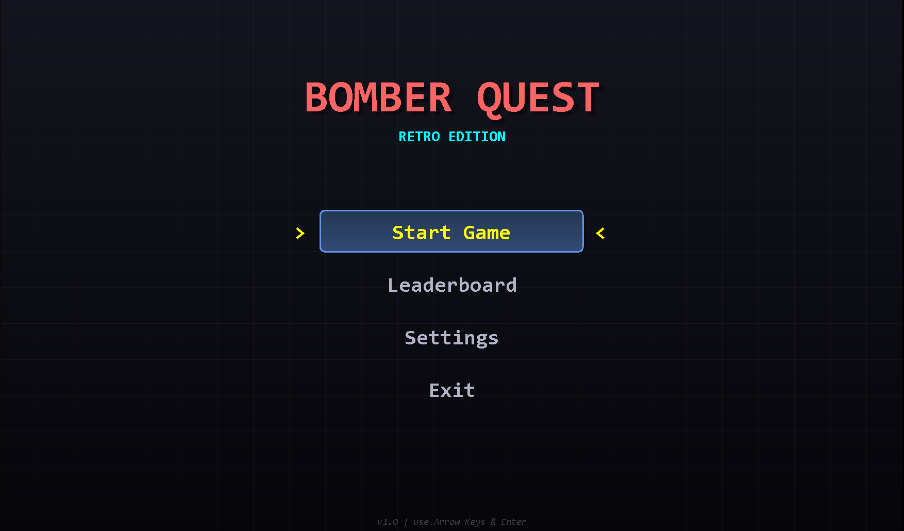
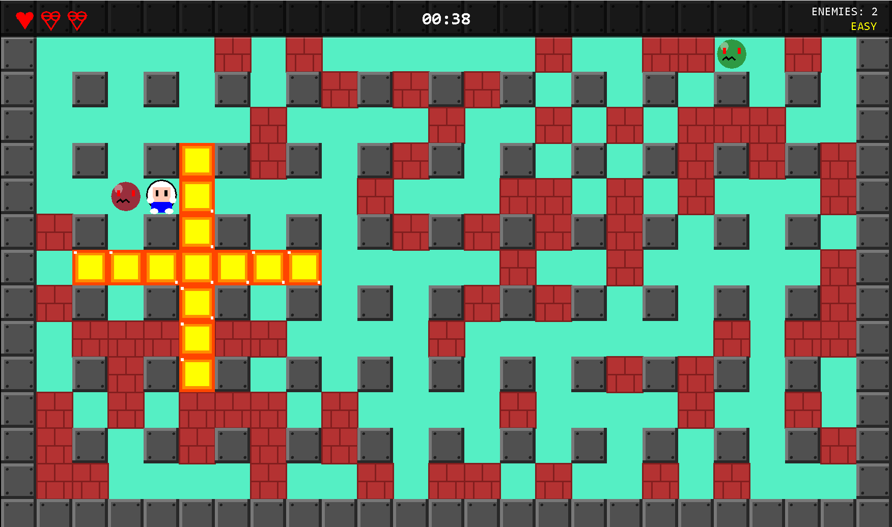
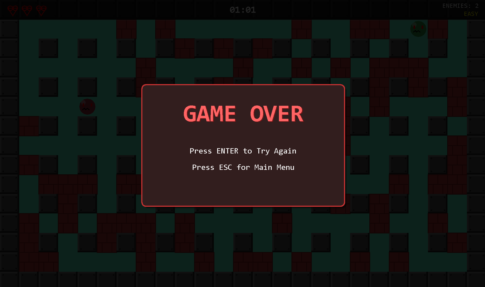

# BomberMan - Tugas Besar PBO

**Mata Kuliah:** Pemrograman Berorientasi Objek Praktek  
**Dosen:** Pak Ardhian E.  
**Program Studi:** D3 Teknik Informatika  
**Institusi:** Politeknik Negeri Bandung  

## Anggota Kelompok
1. **Wyandhanu Maulidan Nugraha**
2. **Gema Adzan Firdaus**
3. **Muhamad Syahid**

---

## Deskripsi Proyek
BomberMan adalah game strategi klasik yang dikembangkan menggunakan bahasa pemrograman Java. Proyek ini mengimplementasikan berbagai konsep pemrograman berorientasi objek tingkat lanjut sesuai dengan rubrik penilaian tugas besar.

## Implementasi Teknis (Rubrik Penilaian)

### 1. Penerapan Minimal 3 Design Pattern (20 Poin)
Kami menerapkan 4 design pattern dalam proyek ini untuk memastikan kode yang modular dan mudah dipelihara:

*   **Singleton Pattern**: Diterapkan pada `SoundManager` untuk memastikan hanya ada satu instance yang mengatur audio di seluruh permainan.
    *   *Lokasi:* `src/com/bomberman/managers/SoundManager.java`
*   **State Pattern**: Digunakan untuk mengatur alur permainan (Menu, Playing, GameOver, Victory). Setiap state adalah kelas terpisah yang mengimplementasikan interface umum.
    *   *Lokasi:* `src/com/bomberman/states/` (MainMenuState, PlayingState, dll)
*   **Observer Pattern**: Diimplementasikan melalui `EventSystem` dimana berbagai komponen game dapat men-subscribe dan bereaksi terhadap event tertentu tanpa coupling yang ketat.
    *   *Lokasi:* `src/com/bomberman/events/EventSystem.java`
*   **Object Pool Pattern**: Digunakan untuk efisiensi memori dengan menggunakan ulang objek yang sering dibuat dan dihancurkan (seperti partikel ledakan).
    *   *Lokasi:* `src/com/bomberman/utils/ObjectPool.java`

### 2. Penerapan JUnit (15 Poin)
Unit testing diimplementasikan menggunakan framework JUnit untuk memverifikasi logika inti permainan.
*   **Cakupan Test**: Logika game manager, factory entitas, dan utilitas.
*   *Lokasi:* `src/test/java/`

### 3. Penerapan Java Collection Framework (JCF) (10 Poin)
Kami memanfaatkan berbagai struktur data JCF untuk manajemen data yang efisien:
*   **HashMap**: Digunakan di `SoundManager` untuk menyimpan dan mengakses klip audio berdasarkan nama, dan di `EventSystem` untuk memetakan tipe event ke listenernya.
*   **ArrayList**: Digunakan secara luas untuk menyimpan daftar entitas game, listener, dan objek dinamis lainnya.
*   **PriorityQueue**: Digunakan dalam `EventSystem` untuk memproses event berdasarkan prioritas urutan.

### 4. Penerapan Clean Code (15 Poin)
Kode ditulis dengan memperhatikan prinsip Clean Code:
*   **Penamaan Variabel & Fungsi**: Jelas dan deskriptif (contoh: `SoundManager.playMusic()`, `EventSystem.subscribe()`).
*   **Single Responsibility Principle**: Setiap kelas memiliki satu tanggung jawab utama (contoh: `SoundManager` hanya mengurus suara, `GameState` hanya mengurus logika state).
*   **Struktur Modular**: Kode dipisahkan ke dalam package yang logis (`managers`, `states`, `entities`, `events`).

### 5. Penerapan Generic Programming (15 Poin)
Generics digunakan untuk menciptakan komponen yang reusable dan type-safe:
*   **Event System**: `EventSystem<T extends GameEvent>` memungkinkan sistem event menangani berbagai tipe event turunan dengan aman.
*   **Object Pool**: `ObjectPool<T>` memungkinkan pooling untuk tipe objek apa pun tanpa perlu casting manual.

### 6. Penerapan GUI (15 Poin)
Antarmuka pengguna dibangun menggunakan Java Swing/AWT:
*   **Custom Rendering**: Game loop melakukan rendering grafis secara manual ke `Canvas` atau `JPanel` untuk performa game yang optimal.
*   **Event Handling**: Menangani input keyboard dan mouse untuk kontrol pemain dan navigasi menu.

### 7. Design Diagram Kelas (10 Poin)
Diagram kelas telah dirancang untuk memvisualisasikan struktur dan hubungan antar kelas dalam sistem.
*   *File Diagram:* Tersedia di folder `diagrams/` (misalnya `class_diagram_overview.png`).

---

## Screenshot Game

Berikut adalah tampilan antarmuka game saat dijalankan:

### Main Menu


### Gameplay


### Game Over / Victory


---

---

## Cara Menjalankan

### Opsi 1: Menggunakan Script (Paling Mudah)

#### Untuk Menjalankan Game:
```bash
# Double-click file atau jalankan di terminal:
run.bat
```

#### Untuk Compile Ulang:
```bash
# Jika ada perubahan kode, compile ulang dengan:
compile.bat
```

### Opsi 2: Manual via Command Line

#### 1. Compile (jika belum/ada perubahan kode):
```bash
# Pastikan berada di direktori root proyek
cd C:\Users\nunu\Downloads\BOMBERMAN_PBO\BomberMan

# Compile semua file Java
javac -d bin -sourcepath src src\com\bomberman\*.java src\com\bomberman\core\*.java src\com\bomberman\entities\*.java src\com\bomberman\events\*.java src\com\bomberman\exceptions\*.java src\com\bomberman\managers\*.java src\com\bomberman\powerups\*.java src\com\bomberman\states\*.java src\com\bomberman\utils\*.java
```

#### 2. Jalankan Game:
```bash
# Dari direktori root proyek
java -cp bin com.bomberman.BomberQuest
```

### Persyaratan Sistem
- **Java JDK**: Versi 8 atau lebih tinggi
- **OS**: Windows, Linux, atau macOS
- **Memory**: Minimal 256 MB RAM
- **Display**: Resolusi minimal 1280x720

### Kontrol Game
- **Arrow Keys / WASD**: Gerakkan pemain
- **SPACE**: Letakkan bom
- **ESC**: Pause/Menu
- **Enter**: Pilih menu

### Troubleshooting
- **"Java is not recognized"**: Pastikan Java JDK terinstall dan ada di PATH
- **ClassNotFoundException**: Pastikan Anda menjalankan dari direktori root proyek
- **Compilation error**: Pastikan semua file source lengkap di folder `src`

---

## Struktur Proyek
```
BomberMan/
├── src/                    # Source code Java
│   └── com/bomberman/
│       ├── BomberQuest.java
│       ├── core/           # Core game managers
│       ├── entities/       # Game objects (Player, Enemy, etc)
│       ├── states/         # Game states
│       ├── powerups/       # Power-up system
│       ├── managers/       # Singleton managers
│       ├── events/         # Event system
│       ├── utils/          # Utility classes
│       └── exceptions/     # Custom exceptions
├── bin/                    # Compiled .class files
├── res/                    # Resources (images, sounds)
├── lib/                    # External libraries (JUnit)
├── diagrams/               # UML diagrams
├── compile.bat             # Script kompilasi
├── run.bat                 # Script menjalankan game
└── README.md

```

---

## Fitur Game
- ✅ Multiple game states (Menu, Playing, GameOver, Victory)
- ✅ Intelligent enemy AI with A* pathfinding
- ✅ Power-up system (Speed, Bomb Capacity, Explosion Range)
- ✅ Smooth state transitions with effects
- ✅ Sound management system
- ✅ Leaderboard with score tracking
- ✅ Customizable settings (Resolution, Effects, Volume)
- ✅ Object pooling for performance optimization
- ✅ Event-driven architecture

---

